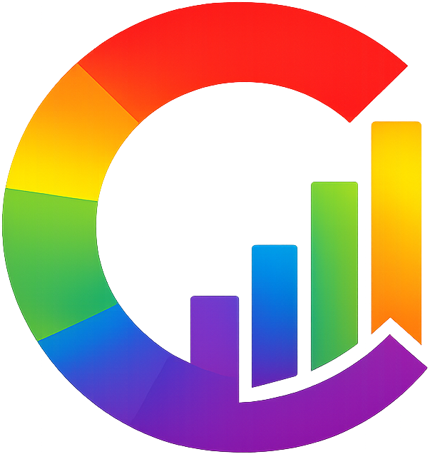

# The Corporate Pride Index: A Technical and Conceptual Overview

**Independent Research Project**
Paul Andrew Turner Jr. · June 2026
[pandrewturner.github.io/corporate-pride-index](https://pandrewturner.github.io/corporate-pride-index)

---

## Executive Summary

The Corporate Pride Index is an independent, evidence-based accountability instrument that scores 200 major American companies (0–100) on the depth and consistency of their LGBTQ+ support. Every score is derived from documented, sourced actions — financial donations, policy language, lobbying records, public statements, and verified reversals — using a transparent formula that distinguishes substance from symbolism.

The project was built in response to a specific, documentable phenomenon: between 2022 and 2025, organized political pressure campaigns prompted dozens of major American corporations to quietly roll back commitments they had publicly made to the LGBTQ+ community. The index exists to document that record, company by company, with citations.

The site is built with React, TypeScript, and Vite. Every score is recomputed from raw source data at build time and validated against the underlying formula. Nothing is trusted without verification; nothing ships without passing validation.

---

## Background and Motivation

For roughly a decade, corporate LGBTQ+ support became standard practice in American business. Rainbow logos, Pride merchandise, and public CEI participation were common enough to be nearly universal among Fortune 500 companies. But the conditions under which those commitments were made — a relatively stable political environment and an expanding cultural consensus — made them easy. They revealed little about whether the support was principled or performative.

Beginning around 2022 and accelerating sharply after the second Trump inauguration on January 20, 2025, those commitments were tested. Boycott campaigns, regulatory threats, and political pressure prompted a wave of corporate retreats: Pride merchandise quietly pulled from shelves, DEI language scrubbed from mission statements, employee resource groups defunded, and public LGBTQ+ affiliations deleted or archived.

The Corporate Pride Index was built on a direct observation: the retreat itself was the most informative data point. A company that publicly supported the LGBTQ+ community and then reversed that support when it became costly revealed something the initial support never could — that the commitment was contingent, not principled.

Most existing tools (principally the HRC's Corporate Equality Index) assess compliance at a point in time: does the company currently have the relevant policies? The CPI asks a different question: **what does the totality of the record prove?** A company that adopted every recommended policy but reversed them under political pressure should not score the same as a company that adopted those policies and held them. The index is designed to make that distinction legible.

---

## Scope

- **Universe:** 200 major American companies, concentrated in the Fortune 500 and S&P 500, spanning 15+ sectors.
- **Time horizon:** All documented actions are included regardless of date; the weight of recent reversals is captured through point asymmetry (see Scoring Framework below), not arbitrary time cutoffs.
- **Data source:** A structured Excel workbook containing a Company_Master sheet, an Action_Log (the primary evidence trail), a Social_Media_Log, a Statements_Reports sheet, a Score_Rationale sheet, a Scoring_Reference rubric, and a Sector_Summary.

---

## Scoring Framework

### The Formula

Every company begins from a neutral baseline of **50**. Documented actions move the score up or down across five positive tiers and one uncapped negative category:

```
score = clamp(
    50                                   // neutral baseline
  + min(20, cosmetic + commercial)       // the rainbow-washing cap
  + civic + financial + structural       // substance, uncapped
  + negative,                            // harm, uncapped
  0, 100
)
```

### Tier Definitions

| Tier | Direction | Examples | Cap |
|------|-----------|----------|-----|
| **Cosmetic** | Positive | Pride logo, Pride post, branded merchandise | Combined with Commercial, capped at +20 |
| **Commercial** | Positive | LGBTQ+-targeted marketing, Pride collections | Combined with Cosmetic, capped at +20 |
| **Civic** | Positive | Event sponsorships, community partnerships | Uncapped |
| **Financial** | Positive | Donations to LGBTQ+ organizations, ERG funding | Uncapped |
| **Structural** | Positive | DEI policies, inclusive benefits, policy language | Uncapped |
| **Negative** | Negative | Lobbying against LGBTQ+ legislation, reversals, anti-trans donations | Uncapped |

### The +20 Cosmetic Cap

Rainbow logos, Pride posts, and merchandise collections are real but cheap signals. No volume of branding contributes more than 20 points. A company cannot post its way into being an ally. To score above the Neutral band, it must spend, show up, or change policy.

This cap was designed to address a specific failure mode of simpler scoring methods: the company that invests heavily in Pride branding while simultaneously donating to anti-LGBTQ+ political campaigns. Without a cap, the branding would obscure the donations. With it, the negative actions fall through to the score directly.

### Reversal Asymmetry

Negative actions are both uncapped and individually heavier than their positive equivalents by design. Lobbying against LGBTQ+ legislation costs −40; an explicit pro-LGBTQ+ DEI policy earns +20. A full reversal of public DEI commitments costs −30 to −40; establishing those commitments earned +20.

This asymmetry reflects the evidential logic of reversals. Adopting a policy under favorable conditions is weak evidence of genuine commitment — the conditions make it easy. Abandoning that same policy under pressure is strong evidence of its absence — the conditions make abandonment costly, yet it happened anyway. A reversal doesn't just subtract recent positive points. It retroactively reveals what the earlier support was worth.

### Band Classification

Scores map to six labeled bands:

| Band | Range | Interpretation |
|------|-------|----------------|
| **Champion** | 80–100 | Sustained, structural, publicly held through pressure |
| **Ally** | 65–79 | Real support with substance; may have minor gaps or recent softening |
| **Neutral** | 50–64 | Baseline; cosmetic gestures without structural backing, or no significant record |
| **Performative** | 35–49 | Visible support but evidence of it being conditional or pressure-driven |
| **Harmful** | 20–34 | Active negative actions that exceed or dominate the positive record |
| **Adversarial** | 0–19 | Predominantly hostile; documented opposition with little or no offsetting support |

The neutral baseline of 50 is meaningful: a company with no documented actions scores exactly 50. The index does not presume corporate hostility any more than it presumes corporate commitment. The burden is on the evidence.

---

## Evidence Standards

### Action Log

The Action_Log is the primary evidence trail. Every logged action is:

- **Discrete** — one event, not a category
- **Dated** — year at minimum, full date where available
- **Sourced** — a URL to a primary source (company press release, FEC filing, news report, HRC report, OpenSecrets record)
- **Typed** — assigned an Action ID that maps to a fixed point value in the Scoring_Reference rubric
- **Polarity-classified** — Positive or Negative

Where companies deleted or altered their own public statements — removing Pride content, scrubbing DEI pages, archiving press releases — the archive and news reporting on the deletion are cited. The deletion itself is part of the record.

### Context Flags

Five binary context flags supplement the numeric score. They never modify the number; they tell the reader how to interpret it:

- **Post-Jan 2025 Reversal** — action occurred after the second Trump inauguration
- **Pressure-Driven** — reversal was documented as a direct response to a boycott campaign or regulatory threat
- **June-Only** — LGBTQ+ activity is limited to Pride month
- **Trans/NB Exclusion** — policies exclude transgender and nonbinary employees or customers
- **Geographic Hypocrisy** — public LGBTQ+ support in visible markets, documented exclusion or silence in others

### Sources Used

- HRC Corporate Equality Index (annual reports)
- GLAAD Corporate Accountability reports
- Company press releases, ESG disclosures, and public policy pages
- FEC and OpenSecrets campaign-finance records
- Established news reporting (Reuters, AP, Bloomberg, The New York Times, The Washington Post, Axios, etc.)
- Wayback Machine archives for deleted content

---

## Technical Architecture

### Build-Time Ingestion

The data pipeline runs at build time, before the TypeScript compiler and Vite bundler touch any code. It:

1. Reads the Excel workbook (`Corporate_Pride_Index_Data.xlsx`) using SheetJS
2. Validates every Action_Log row's point value against the fixed Scoring_Reference rubric
3. Recomputes every company's score from raw Action_Log rows using `src/lib/scoring.ts`
4. Asserts that the derived score matches an independent evaluation of the workbook's own formula
5. Verifies referential integrity across all sheets (every referenced company must exist in Company_Master)
6. Computes Sector_Summary statistics (sector averages, ranges, band counts)
7. Emits `src/data/index-data.json`

**The build fails if any validation step fails.** A workbook edit that breaks consistency cannot ship.

This design means the published scores and the published methodology are the same artifact: the formula in the methodology documentation and the formula in `scoring.ts` are the same module. They cannot drift apart.

### Technology Stack

- **Frontend:** React 18, TypeScript, Vite, React Router v6, Tailwind CSS
- **Charting:** Recharts (histogram, sector chart)
- **Data ingestion:** SheetJS (xlsx), Node.js, ts-node
- **Deployment:** GitHub Pages, GitHub Actions (automated deploy on push to main)
- **Analytics:** Google Analytics 4
- **AI assistance:** Claude (Anthropic) — data collection, research, analysis, and production

### Code Architecture

The project is a pure presentation layer over a validated JSON file. The scoring logic is in a single standalone module (`scoring.ts`) used by both the ingest pipeline and the Methodology page. This means the worked examples on the methodology page are computed from the same code path that produced the scores in the table — not a separate demonstration.

Routes are code-split via React lazy/Suspense. The chart components are extracted into a separate chunk to keep the initial bundle below 400KB.

---

## What the Index Does Not Do

**It does not score companies on employee satisfaction.** Internal culture data is not publicly verifiable. The index scores documented external and policy actions only.

**It does not use self-reported data without verification.** HRC CEI scores are noted as context but do not directly contribute to the CPI score. Actions are independently sourced.

**It does not weigh sector or company size.** A small company doing nothing and a large company doing nothing both score 50. Scale would make the index easier to game.

**It does not presume recent reversals are permanent.** Context flags and the written rationale note trajectory (Improving / Stable / Declining / Sharp Reversal) so readers can account for direction, not just position.

**It is not a comprehensive audit of every company's behavior.** It is a scored index of documented, sourced, public actions. A company with no documentation does not score zero — it scores 50. Absence of evidence is not evidence of harm.

---

## Limitations and Caveats

**Coverage is limited by public documentation.** Actions that occurred but were not publicly documented — or that were documented only in internal communications never made public — cannot be scored. This likely creates a systematic bias toward larger companies with more media coverage and more aggressive PR operations in both directions.

**Point values reflect analytical judgment.** The fixed rubric is published and inspectable, but the assignment of any action to a category and the category point values are judgments made by the analyst. Reasonable people can disagree with specific values. The published rubric is designed to invite exactly that disagreement.

**The index is a snapshot updated over time.** Company behavior evolves; the workbook is updated as significant actions are documented. Scores at any given build reflect the record as of the last workbook update.

**Sector labels are as specific as the underlying data.** Some sectors in the 200-company universe have only one or two entries; sector averages for those are not statistically meaningful.

---

## Worked Examples

### Apple — 100, Champion

Apple's score reflects sustained structural investment: inclusive benefits, consistent policy language, a long record of financial support for LGBTQ+ organizations, and public maintenance of those commitments through the 2025 backlash. The cosmetic/commercial cap is irrelevant here — the structural and financial points push well past the ceiling independently. Structure is what the formula rewards most, and Apple's record on structure is the longest and most consistent in the index.

### Verizon — 32, Harmful

Years of visible support — Pride branding, sponsorships, a funded ERG — were negated by a written 2025 reversal under regulatory pressure. The positive record accumulated over years was real but shallow: it was concentrated in the cosmetic/commercial tier and the civic tier, with limited structural depth. When the reversal came, the negative points exceeded the positive foundation. Support that evaporates when it carries a cost is scored as what the evaporation reveals it to have been.

### Salesforce — 78, Ally

Salesforce's reversal — softening public commitments in early 2025 — hurt its score, but the company had built enough structural depth (benefits, policy language, financial support, a long consistent record) that the reversal could not collapse the score. This is what the formula is designed to show: real structural investment absorbs pressure better than cosmetic depth. The score dropped without collapsing.

### Tesla — 18, Adversarial

Tesla has no significant positive LGBTQ+ record. Its score is driven entirely by documented negative actions: political donations to anti-LGBTQ+ candidates and causes, and the absence of any offsetting support. With no positive record to protect, negative points fall straight through to the bottom band. The baseline of 50 offers no shelter from documented opposition.

---

## Future Directions

The current index covers 200 companies. Potential expansions include:

- **Expanded universe** — broader coverage of mid-cap companies, private companies with significant public footprints, and non-U.S. multinationals operating in the American market
- **Temporal tracking** — year-over-year score history, showing trajectory quantitatively rather than qualitatively
- **Legislative mapping** — linking negative political donations to specific bills and their outcomes
- **Sector benchmarking** — peer comparison tools showing where a given company stands relative to its industry

The underlying data architecture is designed to support all of these: the JSON schema already includes full action histories with dates, the build-time validation pipeline is extensible, and the scoring module is stateless and testable.

---

## About the Project



The Corporate Pride Index is an independent, non-commercial research project. It has no affiliation with the HRC, GLAAD, or any other LGBTQ+ advocacy organization. Its funding is nil; its data is public; its methodology is published.

The project was designed, built, and is maintained by **Paul Andrew Turner Jr.**, an Orlando-based data scientist and finance professional. He is an openly gay man and active member of the Orlando LGBTQ+ community.

The project can be reached at [PAndrewTurner@outlook.com](mailto:PAndrewTurner@outlook.com).

---

*Built with React + TypeScript + Vite + Tailwind + Recharts. Research, analysis, and production assisted by Claude (Anthropic). Data is public; methodology is published; every number is one click from its evidence.*

<p align="center">
  
</p>
